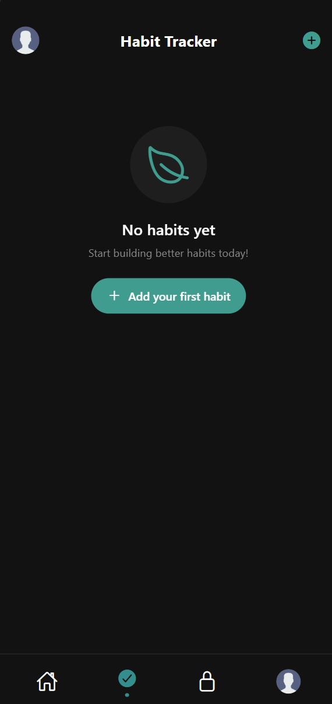

# Kaeb - Application mobile de développement personnel

> Projet académique - Développement d'applications mobiles
> Cégep de Shawinigan | Automne 2024

## Description

Kaeb est une application mobile dédiée aux étudiants qui souhaitent améliorer leur qualité de vie et se désintoxiquer des réseaux sociaux. L'application propose un système de suivi d'habitudes et un mode de concentration pour favoriser la productivité.

## Technologies utilisées

- **Frontend** : React Native, CSS
- **Backend** : JavaScript (Node.js)
- **Base de données** : MySQL
- **Architecture** : MVC (Model-View-Controller)

## Fonctionnalités principales

- Système d'authentification et gestion des utilisateurs
- Suivi des habitudes hebdomadaires et mensuelles
- Partage des réussites avec la communauté
- Mode "Lock In" pour bloquer les distractions

## Objectifs d'apprentissage

- Développement mobile cross-platform avec React Native
- Intégration backend/frontend avec API REST
- Gestion de base de données relationnelle
- Architecture MVC pour applications mobiles
- Travail collaboratif en équipe

## Captures d'écran

  
  
  
  

## Installation et utilisation

### Prérequis

- Node.js 14+
- React Native CLI
- MySQL 8.0+
- Expo (optionnel)

